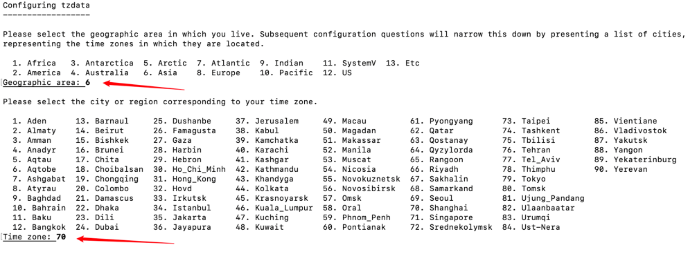
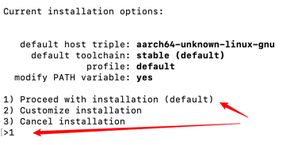
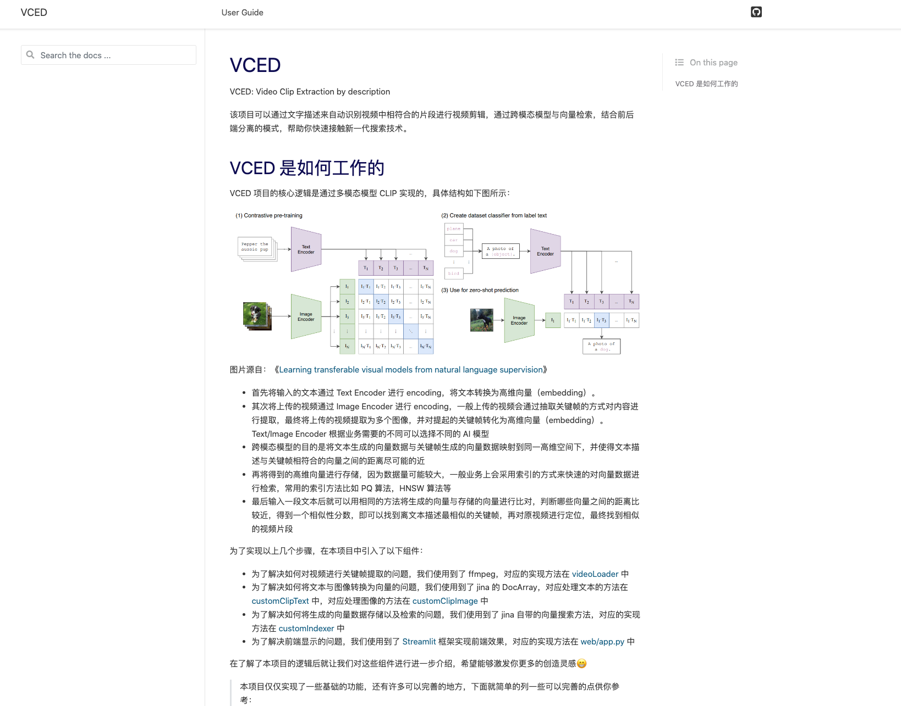

<h1 align="center">
	VCED: Video Clip Extraction by description
	<br>

</h1>
<div align="center">
  <a href="https://www.python.org/downloads/" target="_blank"></a>
  <a href="https://linklearner.com/"></a>

  <h3 align="center">
    <a href="https://linklearner.com/">Datawhale Website</a>
    <br/>
    <a href="https://linklearner.com/">Docs</a>
    <span> | </span>
    <a href="https://github.com/datawhalechina/vced#%E5%8F%82%E4%B8%8E%E8%B4%A1%E7%8C%AE">Contribute</a>
  </h3>

</div>

----------------------------------------
VCED 可以通过你的文字描述来自动识别视频中相符合的片段进行视频剪辑。该项目基于跨模态搜索与向量检索技术搭建，通过前后端分离的模式，帮助你快速的接触新一代搜索技术。

如果你喜欢本项目欢迎给一个 **⭐ !**

----------------------------------------

[QuickStart](https://github.com/datawhalechina/vced#quickstart) - [项目结构](https://github.com/datawhalechina/vced#%E6%96%87%E6%A1%A3) - [文档](https://github.com/datawhalechina/vced#%E6%96%87%E6%A1%A3) - [Learning Roadmap](https://github.com/SuperSupeng/vced/blob/4387bbeaf7c66cf03532ef64617a8877481dad0d/Roadmap.md) - [反馈](https://github.com/datawhalechina/vced#%E5%8F%8D%E9%A6%88) - [参与贡献](https://github.com/datawhalechina/vced#%E5%8F%82%E4%B8%8E%E8%B4%A1%E7%8C%AE) - [关注我们](https://github.com/datawhalechina/vced#%E5%85%B3%E6%B3%A8%E6%88%91%E4%BB%AC) - [License](https://github.com/datawhalechina/vced#license)

----------------------------

<h2 align="center">
   VCED demo
   <br/>
   <br/>
  	
</h2>

## QuickStart

### 通过 docker 启动

[docker安装](./docker_install.md)

``` bash
# 拉取项目
cd ~
git clone https://github.com/kainstan/vced.git
# 进入项目目录
cd ~/vced
# 通过shell脚本启动
./startup.sh
```

### 通过源代码启动

#### 说明

本项目依赖以下环境，在进行具体的安装之前请确保你的电脑已经安装好这些依赖

1. 创建 python3.9 环境
2. 安装 rust, ffmpeg
3. 安装 clip `pip install git+https://github.com/openai/CLIP.git`

下面的Shell脚本已做相应的操作，一键执行即可。

*Jina 暂不支持在 Windows 安装，如需在 Windows 上安装 Jina 请通过 WSL 方式，详情见：[Jina 轻松学 —— Windows中安装Jina](https://blog.csdn.net/Jina_AI/article/details/122820646)*

#### Shell脚本安装环境





<font color="lightcoral">*注意：安装期间可能需要人工干预选择安装选项或时区等（并不是每个小伙伴都会出现时区选择）*</font>

```
# 拉取项目
cd ~
git clone https://github.com/kainstan/vced.git
# 进入项目目录
cd ~/vced
# 通过shell脚本启动
./startup.sh native
```

#### 启动 server

```bash
# 进入 server 文件夹
cd ~/vced/code/service
# 启动服务端
python app.py
```

#### 启动 web

前端我们通过 [Streamlit](https://streamlit.io/) 搭建。[Streamlit](https://streamlit.io/) 是一个 Python Web 应用框架，但和常规 Web 框架，如 Flask/Django 的不同之处在于，它不需要你去编写任何客户端代码（HTML/CSS/JS），只需要编写普通的 Python 模块，就可以在很短的时间内创建美观并具备高度交互性的界面。

```bash
# 进入 web 文件夹
cd ~/vced/code/web
# 启动服务端
streamlit run app.py
```

Streamlit默认启动的端口为8501，也可以通过 `localhost:8501` 进行访问

## 项目结构

```
    ├── code/service
        ├── customClipImage (通过 CLIP 模型处理上传的视频)
        ├── customClipText  (通过 CLIP 模型处理输入的文字)
        ├── customIndexer   (创建向量数据的索引)
        ├── videoLoader     (对上传的视频进行处理)
        ├── workspace       (用于存储生成的向量数据)
        ├── app.py          (后端主程序)                                                       
    ├── code/web
        ├── data            (用于存储上传的视频)
        │   ├── videos      (用于存储剪辑好的视频片段)
        ├── app.py          (前端主程序)  
	  ├── Dockerfile                                                     
    ├── requirements.txt  
```

## 文档

如果你想在本地查阅文档可以通过以下方式实现

1. 将项目下载到本地
2. 用浏览器打开 [docs/build/html/index.html](./docs/build/html/index.html)

如果你对文档内容有修改想要查看最新的内容可以通过以下方式

```bash
# 进入 docs 文件夹
cd docs
# 安装相关依赖
pip install -r requirements.txt
# 编译
make html
```

然后就可以在`public`文件夹下双击`index.html`即可看到文档，如下所示


## Learning Roadmap

内容学习路线详见：[Roadmap](https://github.com/datawhalechina/vced/blob/main/Roadmap.md)

## 反馈

- 如果你发现任何问题，请提交 [Issue](https://github.com/datawhalechina/vced/issues).

## 参与贡献

- 如果你想参与到项目中来欢迎查看项目的 [Issue](https://github.com/datawhalechina/vced/issues) 查看没有被分配的任务并提交 PR

如果你对 Datawhale 很感兴趣并想要发起一个新的项目，欢迎查看 [Datawhale 贡献指南](https://github.com/datawhalechina/DOPMC/blob/42a36137ca9a2310459fcaaf7012ac16e8c7039f/CONTRIBUTING.md)。

### 当前贡献者

| 姓名 | 职责 | 简介 |
| :----| :---- | :---- |
| [苏鹏](https://github.com/SuperSupeng) | 项目负责人 | [https://linktr.ee/subranium](https://linktr.ee/subranium) |
| [十一](https://github.com/sshimii) | Jina 教程内容贡献者 | [Github]((https://github.com/sshimii)) |
| [席颖](https://github.com/xiying-boy) | Jina 教程内容贡献者 | [Github](https://github.com/xiying-boy) |
| [范致远](https://github.com/Elvisambition) | 跨模态模型教程内容贡献者 | [Github](https://github.com/Elvisambition) |
| [崔腾松](https://github.com/2951121599) | 项目后端教程内容贡献者 | [CSDN](https://blog.csdn.net/liluo_2951121599) |
| [韩颐堃](https://github.com/YikunHan42) |项目后端教程内容贡献者 | [Homepage](https://yikunhan.me/) |
| [吴祥](https://github.com/zadarmo) | 项目前端教程内容贡献者 | [CSDN](https://blog.csdn.net/destiny_balabala) |
| [边圣陶](https://github.com/Richard-Bian) | Docker 部署教程内容贡献者 | [https://www.bianst.cn](https://www.bianst.cn) |

<a href="https://github.com/datawhalechina/vced/graphs/contributors">
  
</a>

Made with [contrib.rocks](https://contrib.rocks).

### 特别感谢

特别感谢以下项目与作者，其中 B 站 UP 主[人工智能小黄鸭](https://space.bilibili.com/15516023)给本项目提供了灵感，而且本项目的基础代码来自于 [ArthurKing01](https://github.com/ArthurKing01)。
- [ArthurKing01/jina-clip](https://github.com/ArthurKing01/jina-clip)
- [输入关键词就能自动剪视频？我写了一个AI视频搜剪神器？](https://www.bilibili.com/video/BV1n3411u7tJ?vd_source=d3a0e6f272cb4afd9c79cf807eefb3a4)
- [Jina AI](https://jina.ai/)
- [Streamlit](https://streamlit.io/)

再次感谢以上项目与作者，同时感谢 Jina AI 对本项目的支持，Jina AI 是一家神经搜索公司，致力于帮助企业和开发者轻松搭建多模态、跨模态应用。

## 关注我们
<div align=center>
<p>扫描下方二维码关注公众号：Datawhale</p>

</div>

## License

VCED is licensed under [GNU General Public License v3.0](https://github.com/datawhalechina/vced/blob/21f5f745665abcebbe1556238af8070d6e4f5c2e/LICENSE)
